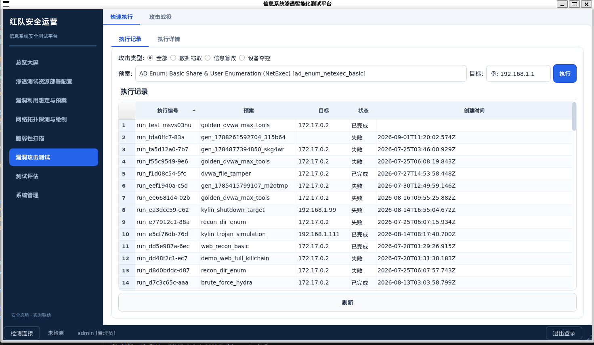

# 信息系统渗透智能化测试平台 — 项目简介

## 一、平台定位

本平台是一套**面向局域网应用的AI驱动自动化渗透测试系统**，核心解决传统渗透测试"依赖人工经验、工具部署复杂、攻击路径选择低效"的痛点。系统实现从**漏洞扫描 → 智能分析 → 攻击方案自动生成 → 自适应执行 → 测试评估报告**的完整闭环，并全面兼容国产操作系统（银河麒麟/统信UOS）。

---

## 二、核心功能（7大模块 / 28项子功能）

| 模块 | 功能 | 完成状态 |
|------|------|---------|
| **① 资源部署配置** | 平台健康检测、LLM接口配置、沙箱引擎切换（Podman/Docker）、容器镜像管理、靶场管理、系统参数配置 | ✅ 已实现 |
| **② 漏洞利用想定与预案** | Playbook创建/编辑/删除/查询，按攻击基线分组筛选，AI自动生成攻击方案，步骤级编排 | ✅ 已实现 |
| **③ 网络拓扑探测与绘制** | 基于扫描结果AI生成拓扑图，交互式节点拖拽/缩放，节点属性编辑（IP/主机名/OS/漏洞标注），拓扑保存 | ✅ 已实现 |
| **④ 脆弱性扫描** | 端口扫描/漏洞扫描/Web扫描/暴力破解4种类型，自动执行，结果结构化存储，智能推荐攻击方案 | ✅ 已实现 |
| **⑤ 漏洞攻击测试** | Playbook按步骤执行，3种攻击类别（数据窃取/信息篡改/设备控制），AI ReAct推理引擎自适应执行，攻击证据记录 | ✅ 已实现 |
| **⑥ 测试评估** | 步骤级评分+MITRE ATT&CK覆盖率加分（覆盖114项技术），自动生成测试报告（支持DOCX/PDF/HTML导出），攻击证据查看 | ✅ 已实现 |
| **⑦ 系统管理** | 5角色RBAC权限管理（admin/teacher/student/operator/viewer），班级管理，课程作业，知识图谱可视化，审计日志 | ✅ 已实现 |

---

## 三、技术特色与创新点

### 1. AI ReAct 自适应执行引擎（核心创新）

- 每步执行后调用大模型分析结果，输出"观察-思考-行动"三段式推理
- 4种动态决策：继续/调参/插入新步骤/提前终止
- 知识图谱增强推理：每步注入MITRE ATT&CK技术信息，使AI决策有据可依
- 启发式规则库：发现HTTP端口自动插入目录枚举，发现SQL错误自动插入注入测试
- 失败自动pivot：某条攻击路径失败时自动切换方向，而非直接终止

### 2. 扫描驱动的攻击方案自动生成

- 规则匹配引擎：基于MITRE精确匹配、严重度驱动、端口覆盖的三级评分
- LLM生成引擎：扫描结果+工具列表→AI生成完整攻击方案
- 双机制互补：AI生成优先，规则匹配兜底，无AI时仍可工作

### 3. 容器化安全工具编排

- 内置28+安全工具（nmap/nikto/nuclei/sqlmap/hydra/john/hashcat/evil-winrm等）
- 9类Alpine容器镜像，Podman/Docker/本地三级回退
- 离线物理迁移：镜像打包为tar，首次启动自动加载，无需联网安装

### 4. 国产化适配架构

- 前端Qt5/C++原生编译，兼容银河麒麟/统信UOS，无需额外运行时
- 容器引擎优先Podman（Daemonless，无需root，国产OS原生支持）
- SQLite单文件数据库，随软件分发，无需独立数据库服务
- 内嵌Node.js运行时，一键启动，支持AppImage/deb/rpm多格式分发

### 5. 知识图谱

- 3,190个节点（13种类型）、5,681条关系边
- 含MITRE ATT&CK全量战术/技术/缓解措施数据
- 前端可视化检索，AI推理时自动注入相关知识

---

## 四、已完成成果

| 维度 | 成果 |
|------|------|
| **代码规模** | 前端~8,000行C++ + 后端~2,400行Node.js + 9个容器镜像 |
| **数据库** | 16张表，覆盖用户/扫描/Playbook/执行/评分/审计全业务 |
| **功能完成度** | 7个一级模块全部实现，28项二级子功能中25项已完成（89%） |
| **安全工具** | 28+工具容器化集成，覆盖侦察/扫描/利用/破解/凭证/云安全全链路 |
| **AI能力** | ReAct推理引擎 + 扫描驱动Playbook生成 + 拓扑AI生成 + OWASP知识注入 |
| **C/S架构** | 前后端分离，JWT认证，RBAC五角色权限，WebSocket实时推送 |
| **部署验证** | 已部署至服务器（192.168.1.103）及云笔电（银河麒麟系统） |
| **竞赛获奖** | 研究生人工智能创新大赛校赛一等奖 |

---

## 五、后续优化计划

基于实际使用反馈，平台在交互流程和智能化程度上仍有较大提升空间，以下为下一阶段重点优化方向：

### 1. 总览大屏重构为任务驱动入口（P0）

**现状问题**：当前总览大屏内容冗余、定位模糊，用户进入后无法直接开始工作。

**优化方案**：
- 将总览大屏**重命名并重构为"任务管理中心"**，作为平台统一入口
- 核心功能：**新建渗透测试任务** + **任务列表管理**（查看/续跑/归档/删除）
- 新建任务时仅需输入目标 IP/网段，后续全流程由大模型驱动，无需逐页面手动操作
- 任务创建后自动进入"AI 驱动渗透流程"，人工仅需在关键节点确认

### 2. 三阶段合并与 AI 全流程驱动（P0）

**现状问题**：网络拓扑探测、脆弱性扫描、漏洞攻击测试分散在三个独立模块，每个界面都需重复输入目标 IP，操作割裂、效率低下。

**优化方案**：
- **合并三个模块为统一的"渗透测试工作台"**，一次目标输入贯穿全流程
- **大模型接管全流程编排**：拓扑探测 → 脆弱性扫描 → 漏洞攻击三阶段由 AI 自主串联
- **边扫边生成**：扫描结果实时产出，AI 根据已获取信息动态调整下一步策略，无需等待全量扫描完成
- **人工确认机制**：AI 在每个阶段转换点（如扫描→攻击）暂停并请求人工确认，兼顾自动化与可控性
- 阶段间数据自动传递：拓扑发现的主机列表 → 扫描目标筛选 → 攻击目标锁定，无需人工搬运

### 3. 知识图谱融合 MITRE ATT&CK（P1）

**现状问题**：知识图谱已包含 3,190 个节点，但 MITRE ATT&CK 数据未充分融入图谱检索与推理链路。

**优化方案**：
- 将 MITRE ATT&CK 全量战术/技术/缓解措施作为知识图谱一等公民，与工具节点、漏洞节点建立显式关联边
- AI 推理时自动查询图谱：给定当前攻击场景，检索匹配的 ATT&CK 技术及其缓解措施
- 前端可视化增强：支持按战术→技术层级展开浏览，点击技术节点关联展示对应工具和历史攻击案例

### 4. ReAct 推理引擎深度集成（P1）

**现状问题**：ReAct 引擎已实现基础框架，但推理过程的可视化、可干预性和上下文管理仍有不足。

**优化方案**：
- **推理过程实时可视化**：前端实时展示 AI 的"观察-思考-行动"三段式推理链，每步决策可追溯
- **人工干预接入**：推理过程中支持人工插入/修改/跳过步骤，AI 基于修改后的状态继续推理
- **上下文窗口管理**：长流程中自动摘要历史步骤，避免上下文超长导致推理质量下降
- **多轮反思**：关键决策点引入自我审视机制，AI 对候选行动进行风险评估后再执行

### 5. 部署配置模块归入系统管理（P2）

**现状问题**：部署配置作为一级模块占用导航空间，但实际使用频率低，属于管理员配置类操作。

**优化方案**：
- 将"资源部署配置"从一级导航降级，**合并至"系统管理"模块下作为子页面**
- 释放出的导航空间用于上述"渗透测试工作台"，使主导航更聚焦于核心业务流程

---

### 优化优先级总览

| 优先级 | 工作内容 |
|--------|---------|
| **P0** | 总览大屏重构为任务管理中心，支持新建任务 + 任务管理 |
| **P0** | 三阶段合并为统一工作台，AI 全流程驱动，边扫边生成，人工确认 |
| **P1** | 知识图谱融合 MITRE ATT&CK，增强推理检索与可视化 |
| **P1** | ReAct 推理引擎深度集成：实时可视化 + 人工干预 + 上下文管理 |
| **P2** | 部署配置模块归入系统管理，释放导航空间 |
| **P2** | AppImage/deb/rpm 正式打包与国产 OS 实机验证 |
| **P2** | 多 AI 代理架构（3-5 个核心代理协同） |

---

## 六、技术规格

| 项目 | 规格 |
|------|------|
| 前端 | Qt 5.15.3 / C++17 / CMake |
| 后端 | Node.js Express（内嵌运行时） |
| 数据库 | SQLite 3（单文件，WAL模式） |
| 容器引擎 | Podman（优先）/ Docker（回退） |
| AI接口 | OpenAI兼容API（支持DeepSeek等） |
| 知识图谱 | MITRE ATT&CK STIX + HexStrike工具知识 |
| 目标系统 | 银河麒麟 / 统信UOS / Ubuntu 22.04 |
| 分发格式 | AppImage / deb / rpm / 便携目录 |
